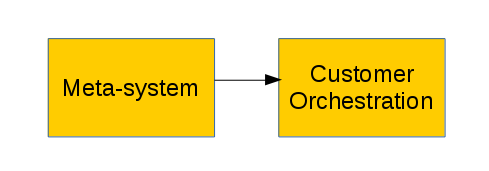
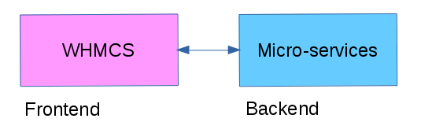
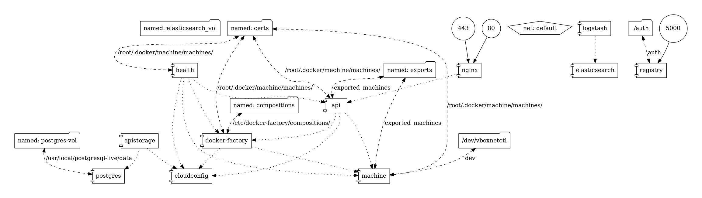
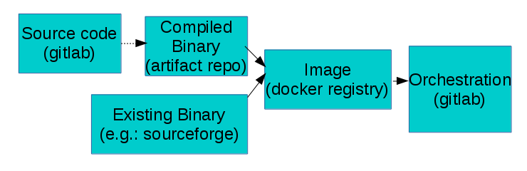

# Geocat Live
### Overview
---

## Live 1.0

+ Virtualized SDI orchestrations
+ Virtualized of servers
+ Backups, Monitoring (Third-party)
+ Servers and orchestrations are managed manually.

<!-- TADA -->
+++?image=assets/toast.jpg

+++
## Live 2.0

+ Implementation of a meta-system, which manages SDI orchestrations @fa[thumbs-up]

---
## Meta-system

- The backend itself, is an orchestration of virtualized (micro) services. |

<!-- --- -->
<!-- ## Meta-system -->

<!--  -->

<!-- --- -->

+++?image=assets/docker-compose.png
+++

## Software Pipeline

+ Shipping containers.
+ From source code to compose files.
+ Semi-automated process.

---
## Live entities

+ Customer: information from the initial register on WHMCS.
+ Product: set of orchestrated services, defined on the config-repo on gitlab.
+ Order: implementation of a product for a given customer.

+++?image=assets/live_entities.png&size=auto 60%

+++
## Live Scope

@fa[check-square fa-lime] The meta-system is designed to manage and related these three entities.
+++?image=assets/live_functionality.png&size=auto 90%

+++?image=assets/toast.jpg

---
## Live composition 2.0

+ Upgrade to version 3 of docker-compose
+ Use of named volumes
+ Replacement of NR by Zabbix
+ Inject EE with relevant container information
+ Externalize data dirs as build arguments
+ Multi-stage builds (experimental)

+++?image=assets/docker-compose2.png

+++?image=assets/ahead.jpg

+++
## Lessons Learned
- More decoupling between functionality and design/implementation |
- Don't automate everything (yet) |
- More consistent effort on Live |

+++
## Next Steps
- @fa[thumbs-up] (Marketing & Sales) |
- @fa[thumbs-up] (Marketing & Sales) |
- @fa[thumbs-up] (Marketing & Sales) |

+++
## Next Steps (technical)
- Backups (ongoing)
- Service logging (ongoing)
- Zabbix (ongoing)
- Improve testing environment (ongoing)
- DNS managing
- Support to extra Modules
- Clustering
- Bridge integration (?)
