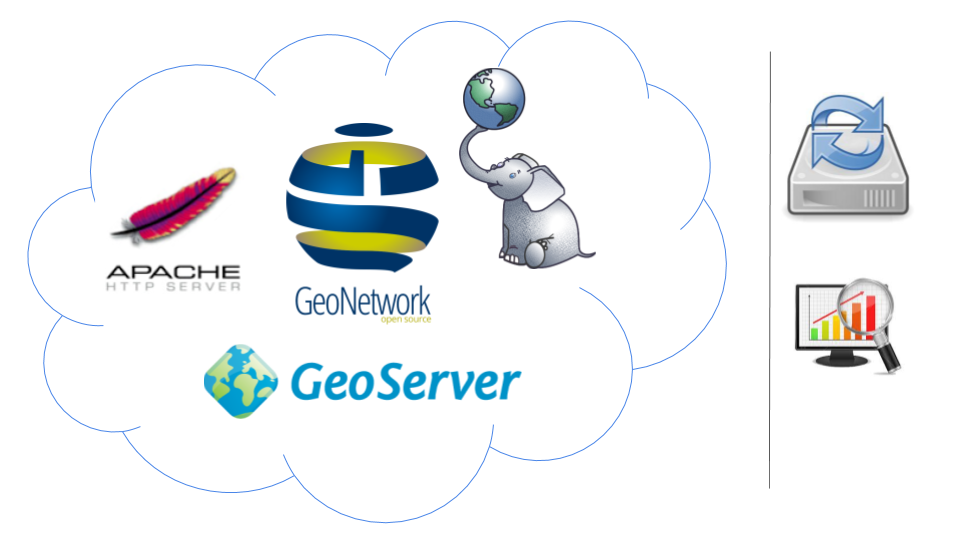
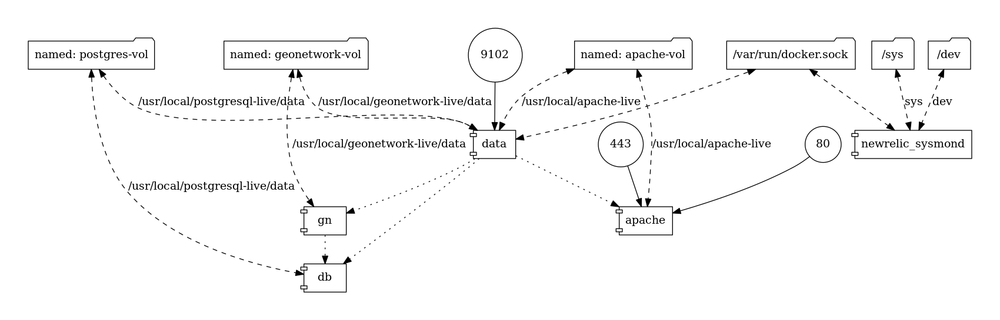

# Geocat Live
### Overview
---

## Live 1.0

+ Virtualization of SDI orchestrations
+ Virtualization of servers
+ Servers and orchestrations are managed manually.

---
## Live 2.0

+ Implementation of a meta-system, which manages SDI orchestrations

---
## Meta-system

+ The backend itself, is an orchestration of virtualized (micro) services.

---
## Meta-system

---
## Software Pipeline

+ Shipping containers.
+ From source code to compose files.
+ Semi-automated process.

---
## Live entities

+ **Customer**: information from the initial register on WHMCS.
+ **Product**: set of orchestrated services, defined on the config-repo on gitlab.
+ **Order**: implementation of a product for a given customer.

---
## Live Scope

The meta-system is designed to manage and related these three entities.
+ Provisioning Servers
+ Launching compositions
+ Registering services for availability monitoring
+ Informing customers of the order status
+ Retrieving the status of servers and services
+ Monitoring services for availability
+ Removing Servers
+ Deregistering services for availability monitoring
+ Invoicing clients
---
## Live composition

The composition itself was also improved in live 2.0:
+ Upgrade to version 3 of docker-compose
+ Use of named volumes
+ Replacement of NR by Zabbix
+ Inject EE with relevant container information
+ Externalize data dirs as build arguments
+ Multi-stage builds (experimental)

---
## Live composition

---
## Next Steps
+ Marketing & Sales |
+ Marketing & Sales |
+ Marketing & Sales |
---
## Next Steps (technical)
+ Backups (ongoing) |
+ Service logging |
+ Integration of Zabbix in the UI |
+ Clustering |
+ DNS managing |
+ Bridge integration (?) |
